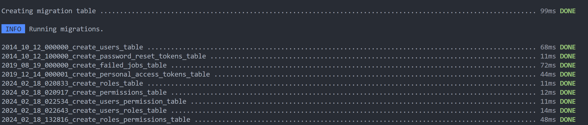
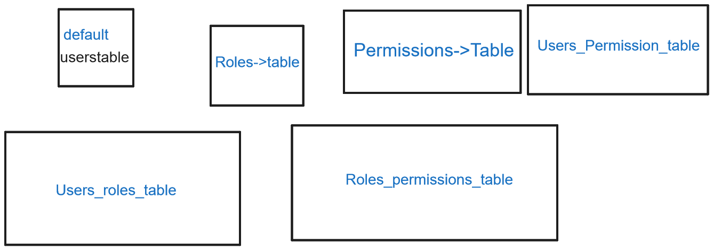

<p align="center"><a href="https://laravel.com" target="_blank"></a></p>

<p align="center">
<a href="https://github.com/laravel/framework/actions"></a>
<a href="https://packagist.org/packages/laravel/framework"></a>
<a href="https://packagist.org/packages/laravel/framework"></a>
<a href="https://packagist.org/packages/laravel/framework"></a>
</p>

## About LaravelRBAC

1.Install Laravel Breeze
2.Make Model for Role

```php

php artisan make:model Role -m
```

-   This artisan command will create Both the Role named Model and roles table as a migration file

```php

   php artisan make:migration create_roles_table --create=roles


```

-   Above code says when we want to create separate command for migration file.

-   Create Model Permission

```php
php artisan make:model Permission -m
```

3. Add columns in permissions and roles migration file ( $table->string('name');
   $table->string('slug');)

4. Create a new Migration file

```php

php artisan make:migration create_users_permission_table --create=users_permissions


```

```

php artisan make:migration create_users_roles_table --create=users_roles
```

-   The --create=users_roles part indicates that you want to create a migration file for creating a table named users_roles. So when you run the migration later using php artisan migrate, it will create a new table in your database with the name users_roles

5. In our migration file userroles and userspermission

```php
declare this we are creating primary key
 $table->unsignedBigInteger('user_id');
            $table->unsignedBigInteger('permission_id');
            $table->primary(['user_id','permission_id']);

```

```php
$table->unsignedBigInteger('user_id');
```

-   why we use unsignedint?
-   Using unsigned is often recommended for foreign keys
    Memory optimization: Unsigned integers use the entire range of positive values for the data type, effectively doubling the upper limit of the integer type, which can be useful for very large databases.

Consistency with primary keys: In many databases, primary keys are typically unsigned integers. By making foreign keys unsigned as well, you maintain consistency and avoid potential issues with data type mismatch.

Performance: Some databases can perform faster operations on unsigned integers compared to signed integers.

6. Migrate and lets see how many tables we have created.
   

-   so now we have created six tables but users table is default one see below sketch of tables to get an overview


